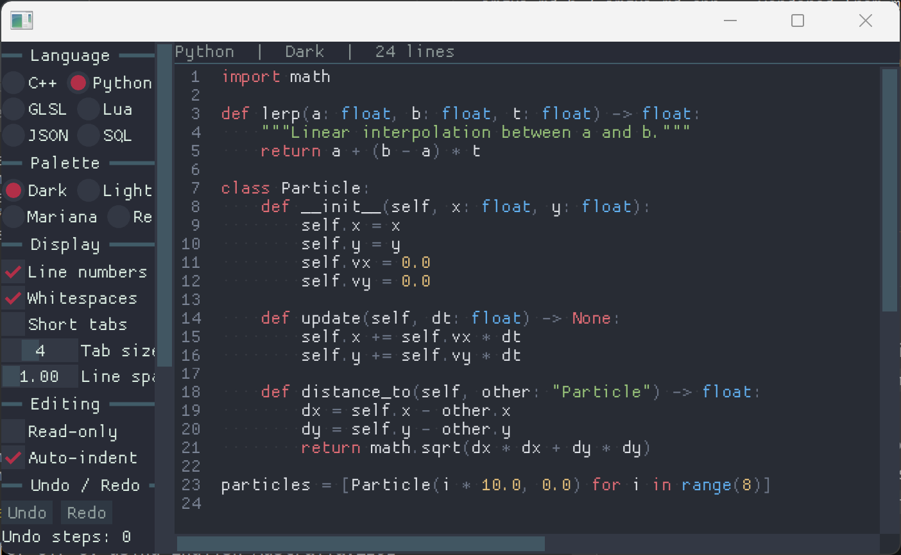

# ofxImGuiTextEdit

openFrameworks addon wrapping [ImGuiColorTextEdit](https://github.com/santaclose/ImGuiColorTextEdit) — a syntax-highlighting text editor widget for [Dear ImGui](https://github.com/ocornut/imgui).

Uses the actively maintained [santaclose fork](https://github.com/santaclose/ImGuiColorTextEdit) which supports the latest ImGui versions.



## Dependencies

- [ofxImGui](https://github.com/ofxyz/ofxImGui)

## Usage

```cpp
#include "ofxImGui.h"
#include "ofxImGuiTextEdit.h"

ofxImGui::Gui gui;
TextEditor editor;

void ofApp::setup() {
    gui.setup();
    editor.SetLanguageDefinition(TextEditor::LanguageDefinitionId::Cpp);
    editor.SetText("// Hello world\n");
}

void ofApp::draw() {
    gui.begin();
    if (ImGui::Begin("Editor")) {
        editor.Render("##editor");
    }
    ImGui::End();
    gui.end();
}
```

### Supported Languages

C, C++, C#, Python, Lua, JSON, SQL, GLSL, HLSL, AngelScript.

## Examples

- **example-textEdit** — Minimal code editor with C++ syntax highlighting.

## License

ImGuiColorTextEdit is licensed under the MIT License. See `libs/ImGuiColorTextEdit/LICENSE` for details.
